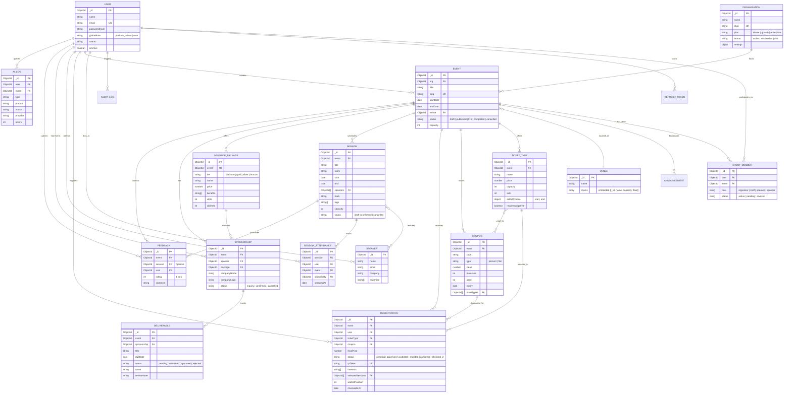

# EventForge — Backend Architecture Document

EventForge is an enterprise-grade corporate event and conference management platform backend built with Node.js, Express, MongoDB, and Mongoose. It delivers multi-tenant organization management, dual-layer Role-Based Access Control (Global vs. Event-scoped), end-to-end data validation via Zod, JWT token rotation with HTTP-only cookies, atomic capacity control with waitlist promotion, 4-point conflict detection scheduling, offline-capable idempotent QR check-ins, multi-tier sponsor workflows, AI generation drafts with deterministic fallbacks, and real-time MongoDB aggregation analytics.

---

## 1. Architectural Overview

EventForge follows a **layered, domain-driven modular architecture** ensuring separation of concerns, testability, and high maintainability:

```
┌─────────────────────────────────────────────────────────────┐
│                       HTTP Client                           │
└──────────────────────────────┬──────────────────────────────┘
                               │
                               ▼
┌─────────────────────────────────────────────────────────────┐
│                 Security & Rate Limiting                    │
│    (Helmet, CORS, Express-Rate-Limit, Mongo-Sanitize)       │
└──────────────────────────────┬──────────────────────────────┘
                               │
                               ▼
┌─────────────────────────────────────────────────────────────┐
│               Middlewares Pipeline                          │
│    authenticate -> authorize(global, event) -> validate    │
└──────────────────────────────┬──────────────────────────────┘
                               │
                               ▼
┌─────────────────────────────────────────────────────────────┐
│                       Routes Layer                          │
│        (HTTP verb mapping, route params, middleware wiring) │
└──────────────────────────────┬──────────────────────────────┘
                               │
                               ▼
┌─────────────────────────────────────────────────────────────┐
│                    Controller Layer                         │
│  (Extract req payload/params, delegate to service, envelope)│
└──────────────────────────────┬──────────────────────────────┘
                               │
                               ▼
┌─────────────────────────────────────────────────────────────┐
│                     Service Layer                           │
│   (Business logic, domain invariants, transactions, events) │
└──────────────────────────────┬──────────────────────────────┘
                               │
                               ▼
┌─────────────────────────────────────────────────────────────┐
│                   Data Access / Models                      │
│     (Mongoose Schemas, indices, virtuals, query helpers)    │
└──────────────────────────────┬──────────────────────────────┘
                               │
                               ▼
┌─────────────────────────────────────────────────────────────┐
│                     MongoDB Database                        │
└─────────────────────────────────────────────────────────────┘
```

### Layer Responsibilities
1. **Routes Layer (`*.routes.js`)**: Defines URI endpoints, maps HTTP verbs, registers authentication/authorization gates, and connects request validation schemas.
2. **Controller Layer (`*.controller.js`)**: HTTP abstraction boundary. Unpacks validated parameters from `req`, delegates business logic execution to services, and packages responses using the standard envelope (`sendSuccess` / `sendError`).
3. **Service Layer (`*.service.js`)**: Pure business logic orchestrator. Enforces domain invariants, performs atomic database operations, manages transactions where required, and emits audit logs or background notifications.
4. **Model Layer (`*.model.js` / `*.js` in `models/`)**: Mongoose schema definitions, field validations, unique and compound indices, virtual fields, and pre/post hooks.

---

## 2. Directory Tree

```
eventforge/
├── docs/
│   ├── ARCHITECTURE.md         # Comprehensive system architecture & design specs
│   ├── API.md                  # Detailed endpoint reference & payload samples
│   └── RBAC.md                 # Dual-layer RBAC specifications and security rules
├── client/                     # Frontend client workspace
├── server/
│   ├── package.json            # Server dependencies, scripts, engines
│   ├── uploads/                # Local uploaded asset storage directory
│   ├── tests/
│   │   ├── setup.js            # MongoMemoryServer / WiredTiger harness & test environment
│   │   ├── auth.test.js        # Authentication & token rotation tests
│   │   ├── rbac.test.js        # Dual-layer RBAC & cross-event isolation tests
│   │   ├── event.test.js       # Event CRUD, workflow & duplication tests
│   │   ├── validation.test.js  # Zod schema error mapping tests
│   │   ├── concurrency.test.js # Parallel registration capacity, FIFO waitlist & coupon rules
│   │   ├── conflict.test.js    # 4-point session scheduling conflict detection tests
│   │   ├── checkin.test.js     # QR event & session check-in idempotency tests
│   │   ├── sponsors.test.js    # Sponsor package allocation, deliverable review & isolation
│   │   ├── ai.test.js          # AI drafts, deterministic templates & hybrid recommendations
│   │   └── analytics.test.js   # Event & platform aggregation pipeline tests
│   └── src/
│       ├── app.js              # Express app instantiation, middleware stack, routes
│       ├── server.js           # Server entry point, DB connection, graceful shutdown
│       ├── config/
│       │   ├── env.js          # Validated environment configuration (dotenv + zod)
│       │   ├── db.js           # Mongoose connection management & hooks
│       │   ├── roles.js        # Global & event role definitions, permissions enum
│       │   └── swagger.js      # Swagger JSDoc & OpenAPI 3.0 specification
│       ├── middlewares/
│       │   ├── authenticate.js # JWT access token verification & user context
│       │   ├── authorize.js    # Two-layer RBAC: Global role + Event-scoped member role
│       │   ├── validate.js     # Zod request schema validation (body, query, params)
│       │   ├── error.js        # Centralized error handler & status mapper
│       │   ├── rateLimit.js    # Standard, auth-specific & AI rate limiters
│       │   └── upload.js       # Multer multipart handler & mime-type filter
│       ├── models/
│       │   ├── Organization.js     # Multi-tenant organization accounts & quotas
│       │   ├── User.js             # User profiles, auth hashes, global roles
│       │   ├── RefreshToken.js     # Rotating refresh tokens & family revocation
│       │   ├── Event.js            # Core event entities, statuses, policies
│       │   ├── EventMember.js      # Event-scoped memberships (organizer, staff, speaker, sponsor)
│       │   ├── Venue.js            # Physical/virtual venues & embedded room layouts
│       │   ├── Speaker.js          # Speaker profiles, bios, expertise, availability
│       │   ├── Announcement.js     # Event broadcasts targeted by audience segment
│       │   ├── AuditLog.js         # Tamper-evident admin & security action logs
│       │   ├── GlobalPolicy.js     # Platform-wide configuration toggles & parameters
│       │   ├── Session.js          # Scheduled agenda sessions, rooms, speakers, capacity
│       │   ├── TicketType.js       # Ticket tiers, pricing, capacity, sales window, approval flag
│       │   ├── Coupon.js           # Percentage/flat discount codes, usage limits, expirations
│       │   ├── Registration.js     # Attendee registrations, statuses, qrToken, waitlist position
│       │   ├── SessionAttendance.js# Scanned attendee session presence records
│       │   ├── SponsorPackage.js   # Sponsorship tiers, slot counts, claimed counters, benefits
│       │   ├── Sponsorship.js      # Confirmed sponsor allocations per event
│       │   ├── Deliverable.js      # Tracked deliverables (logos, decks, videos) & review state
│       │   ├── Feedback.js         # Session and event ratings & comments
│       │   └── AiLog.js            # AI generation prompts, token telemetry & draft logs
│       ├── modules/
│       │   ├── auth/           # register, login, refresh, logout, me, password reset
│       │   ├── users/          # User directory, profile updates, status management
│       │   ├── organizations/  # Multi-tenant orgs, tiers, subscription management
│       │   ├── events/         # Event CRUD, lifecycle (publish/cancel), duplication
│       │   ├── venues/         # Venues & room layouts management
│       │   ├── speakers/       # Speaker catalog & availability
│       │   ├── team/           # Event member invitations & role management
│       │   ├── announcements/  # Event broadcast messaging
│       │   ├── policies/       # Global system policies & admin settings
│       │   ├── uploads/        # Pluggable storage (Local Disk & S3 Interface)
│       │   ├── tickets/        # Ticket types and coupon management
│       │   ├── registrations/  # Atomic registration, waitlist FIFO promotion, approval workflow
│       │   ├── sessions/       # 4-point conflict detection, agenda scheduling, pre-check
│       │   ├── checkin/        # QR code check-in (event & session), live attendance counters
│       │   ├── sponsors/       # Packages, sponsorship allocation, deliverable review flow
│       │   ├── feedback/       # Attendee reviews, star ratings & aggregate sentiment
│       │   ├── ai/             # Draft generators, template fallbacks, hybrid recommendations
│       │   └── analytics/      # High-performance MongoDB aggregations (event & platform)
│       ├── seed/
│       │   ├── index.js        # Comprehensive database seeder (~200 attendees, 20 sessions)
│       │   └── seedData.js     # Deterministic seed data fixtures
│       └── utils/
│           ├── ApiError.js     # Operational API error class (incl. scheduleConflict)
│           ├── asyncHandler.js # Async error propagation wrapper
│           ├── response.js     # Standard response envelope helpers
│           ├── logger.js       # Pino / Morgan structured logger
│           ├── pagination.js   # Cursor & offset pagination, search & sort utility
│           └── storage.js      # Storage provider abstraction (Disk & S3)
└── package.json                # Monorepo root package.json (workspaces)
```

---

## 3. Mermaid Entity-Relationship Diagram (ERD)



---

## 4. Role-Based Access Control (RBAC) Matrix

EventForge enforces a **strict two-layer authorization architecture**:
1. **Global Layer**: `User.globalRole`
   - `platform_admin`: System superuser with omnipotent oversight (manages organizations, global policies, suspends tenants, platform analytics).
   - `user`: Standard platform account capable of managing their own profile, receiving invites, creating organizations/events, registering for tickets.
2. **Event-Scoped Layer**: `EventMember.role` (computed per event)
   - `organizer`: Full administrative control over that specific event (updates, publishing, cancellations, duplicate, team roster, venue assignment, ticket types, coupons, sessions, sponsor deliverables review, analytics).
   - `staff`: Operational duties (view event details, check-in QR scanning, live counters, announcements).
   - `speaker`: Assigned presenter (view event details, receive speaker announcements).
   - `sponsor`: Corporate partner (view own sponsorship, submit deliverable assets).
   - `attendee`: End-user registrant (view public agenda, book tickets, check in via QR, provide feedback, get AI recommendations).

### Detailed RBAC Permission Matrix

| Resource | Action | Platform Admin | Event Organizer | Event Staff | Event Speaker | Event Sponsor | Attendee / User | Public |
| :--- | :--- | :---: | :---: | :---: | :---: | :---: | :---: | :---: |
| **Auth** | Register / Login / Refresh | Yes | Yes | Yes | Yes | Yes | Yes | Yes |
| **Auth** | Manage Own Profile / Me | Yes | Yes | Yes | Yes | Yes | Yes | No |
| **Users** | List Users & Status | Yes | Yes (for invites) | No | No | No | No | No |
| **Organizations** | Create / Update / Suspend | Yes | No | No | No | No | No | No |
| **Global Policies** | View / Update System Settings | Yes | No | No | No | No | No | No |
| **Events** | Create Event | Yes | Yes (User) | No | No | No | No | No |
| **Events** | View Published Events | Yes | Yes | Yes | Yes | Yes | Yes | Yes |
| **Events** | Update / Cancel / Publish / Duplicate | Yes | Yes (Own Event) | No | No | No | No | No |
| **Event Team** | Invite / Remove Staff / Sponsors | Yes | Yes (Own Event) | No | No | No | No | No |
| **Venues** | Manage Venues & Rooms | Yes | Yes | No | No | No | No | No |
| **Speakers** | Manage Speaker Profiles | Yes | Yes | No | No | No | No | No |
| **Announcements** | Post Announcement | Yes | Yes (Own Event) | Yes (Own Event)| No | No | No | No |
| **Announcements** | Read Announcements | Yes | Yes (Own Event) | Yes (Own Event)| Target Match | Target Match | Target Match | No |
| **Ticket Types** | Manage Tickets & Pricing | Yes | Yes (Own Event) | No | No | No | No | No |
| **Ticket Types** | List Available Tickets | Yes | Yes | Yes | Yes | Yes | Yes | Yes |
| **Coupons** | Create / Update / Delete | Yes | Yes (Own Event) | No | No | No | No | No |
| **Coupons** | Validate Coupon | Yes | Yes | Yes | Yes | Yes | Yes (Own Order) | No |
| **Registrations** | Register for Event Ticket | Yes | Yes | Yes | Yes | Yes | Yes (Self) | No |
| **Registrations** | View / Cancel Own Registration | Yes | Yes | Yes | Yes | Yes | Yes (Self) | No |
| **Registrations** | Approve / Reject Registrations | Yes | Yes (Own Event) | Yes (Own Event)| No | No | No | No |
| **Sessions** | Schedule / Update Sessions | Yes | Yes (Own Event) | No | No | No | No | No |
| **Sessions** | Pre-Check Scheduling Conflicts | Yes | Yes (Own Event) | No | No | No | No | No |
| **Sessions** | View Agenda & Sessions | Yes | Yes | Yes | Yes | Yes | Yes | Yes |
| **Check-in** | Scan QR (Event & Session) | Yes | Yes (Own Event) | Yes (Own Event)| No | No | No | No |
| **Check-in** | View Live Attendance Counters | Yes | Yes (Own Event) | Yes (Own Event)| No | No | No | No |
| **Sponsor Packages**| Create / Update Packages | Yes | Yes (Own Event) | No | No | No | No | No |
| **Sponsorships** | Allocate Sponsorship | Yes | Yes (Own Event) | No | No | No | No | No |
| **Sponsorships** | View Sponsorship Details | Yes | Yes (Own Event) | No | No | Own Company Only | No | No |
| **Deliverables** | Create Deliverable Requirement| Yes | Yes (Own Event) | No | No | No | No | No |
| **Deliverables** | Submit Asset | Yes | No | No | No | Own Company Only | No | No |
| **Deliverables** | Review & Approve Deliverable | Yes | Yes (Own Event) | No | No | No | No | No |
| **Feedback** | Submit Session/Event Feedback | Yes | No | No | No | No | Verified Attendee | No |
| **Feedback** | View Aggregate Feedback | Yes | Yes (Own Event) | Yes (Own Event)| No | No | No | No |
| **AI Drafts** | Generate Content Drafts | Yes | Yes | Yes | Yes | Yes | Yes | No |
| **AI Recommendations**| Get Session Matchmaking | Yes | Yes | Yes | Yes | Yes | Yes (Self) | No |
| **Analytics** | View Event Metrics Dashboard | Yes | Yes (Own Event) | Yes (Own Event)| No | No | No | No |
| **Analytics** | View Platform Global Overview | Yes | No | No | No | No | No | No |
| **Uploads** | Upload Media Assets | Yes | Yes | Yes | Yes | Yes | Yes | No |
| **Audit Logs** | View Security & System Audit | Yes | No | No | No | No | No | No |

---

## 5. REST API Contract List

### 5.1 Foundation Modules
- `POST /auth/register` — Register a new account.
- `POST /auth/login` — Authenticate and receive tokens.
- `POST /auth/refresh` — Rotate refresh token.
- `POST /auth/logout` — Revoke refresh token and logout.
- `GET  /auth/me` — Retrieve authenticated user profile and memberships.
- `POST /auth/forgot-password` — Issue password reset request.
- `POST /auth/reset-password` — Complete password reset.
- `GET   /users` — Paginated user directory (Platform Admin / Organizer).
- `GET   /users/:id` — Get user profile.
- `PATCH /users/:id` — Update user profile.
- `PATCH /users/:id/status` — Platform Admin: Activate / suspend user.
- `POST   /organizations` — Platform Admin: Create organization.
- `GET    /organizations` — Platform Admin: List organizations.
- `GET    /organizations/:id` — Get organization profile.
- `PATCH  /organizations/:id` — Platform Admin: Update plan & settings.
- `PATCH  /organizations/:id/status` — Platform Admin: Suspend or reinstate org.
- `DELETE /organizations/:id` — Platform Admin: Soft-delete organization.
- `GET /policies` — Platform Admin: List platform configurations.
- `PUT /policies` — Platform Admin: Update platform policies.
- `POST   /events` — Create new event.
- `GET    /events` — List events with filters.
- `GET    /events/:id` — Get event details.
- `PATCH  /events/:id` — Update event details (Organizer).
- `DELETE /events/:id` — Delete event (Organizer).
- `POST   /events/:id/publish` — Publish event.
- `POST   /events/:id/cancel` — Cancel event with reason.
- `POST   /events/:id/duplicate` — Duplicate event into new draft.
- `POST   /venues` — Create venue.
- `GET    /venues` — List venues.
- `GET    /venues/:id` — Get venue and rooms.
- `PATCH  /venues/:id` — Update venue.
- `DELETE /venues/:id` — Delete venue.
- `POST   /venues/:id/rooms` — Add room to venue.
- `PATCH  /venues/:id/rooms/:roomId` — Update room.
- `DELETE /venues/:id/rooms/:roomId` — Remove room.
- `POST   /speakers` — Create speaker.
- `GET    /speakers` — List speakers.
- `GET    /speakers/:id` — Get speaker profile.
- `PATCH  /speakers/:id` — Update speaker.
- `DELETE /speakers/:id` — Delete speaker.
- `GET    /events/:eventId/members` — List event team members.
- `POST   /events/:eventId/members` — Add event member.
- `PATCH  /events/:eventId/members/:memberId` — Update member role.
- `DELETE /events/:eventId/members/:memberId` — Remove member.
- `GET    /events/:eventId/announcements` — List announcements.
- `POST   /events/:eventId/announcements` — Broadcast announcement.
- `GET    /events/:eventId/announcements/:id` — Get announcement.
- `PATCH  /events/:eventId/announcements/:id` — Update announcement.
- `DELETE /events/:eventId/announcements/:id` — Delete announcement.
- `POST /uploads` — Upload media file.
- `GET  /audit-logs` — Query audit logs (Platform Admin).

### 5.2 Capstone Feature Modules
- `GET    /events/:eventId/tickets` — List ticket types for an event.
- `POST   /events/:eventId/tickets` — Create ticket type with sales window & approval flag (Organizer).
- `PATCH  /events/:eventId/tickets/:id` — Update ticket type pricing, capacity, or dates (Organizer).
- `DELETE /events/:eventId/tickets/:id` — Delete ticket type (Organizer).
- `GET    /events/:eventId/coupons` — List event promotional coupons (Organizer).
- `POST   /events/:eventId/coupons` — Create coupon with % or flat discount, limits, expiry (Organizer).
- `POST   /events/:eventId/coupons/validate` — Validate coupon code against ticket selection.
- `POST   /events/:eventId/register` — Register for event ticket with atomic capacity check & coupon calculation.
- `GET    /events/:eventId/registrations` — List registrations with status filtering (Organizer/Staff).
- `PATCH  /events/:eventId/registrations/:id/approve` — Approve pending registration (Organizer).
- `PATCH  /events/:eventId/registrations/:id/reject` — Reject pending registration (Organizer).
- `GET    /registrations/me` — List my registrations across all events.
- `POST   /registrations/:id/cancel` — Cancel registration and trigger FIFO waitlist auto-promotion.
- `GET    /events/:eventId/sessions` — List agenda sessions with track/tag filters.
- `GET    /events/:eventId/sessions/:id` — Get single session details.
- `POST   /events/:eventId/sessions/check-conflicts` — Live pre-check for 4-point conflicts without persisting (Organizer).
- `POST   /events/:eventId/sessions` — Create session with 4-point conflict rejection (Organizer).
- `PATCH  /events/:eventId/sessions/:id` — Update session with 4-point conflict check excluding self (Organizer).
- `DELETE /events/:eventId/sessions/:id` — Delete session (Organizer).
- `POST   /checkin/event` — Idempotent attendee event QR check-in (Staff).
- `POST   /checkin/session` — Idempotent attendee session attendance check-in (Staff).
- `GET    /events/:eventId/attendance/live` — Real-time attendance rate and session counter dashboard (Staff/Organizer).
- `GET    /events/:eventId/sponsor-packages` — List sponsorship packages.
- `POST   /events/:eventId/sponsor-packages` — Create sponsor package with tier, price, slots (Organizer).
- `PATCH  /events/:eventId/sponsor-packages/:id` — Update sponsor package (Organizer).
- `DELETE /events/:eventId/sponsor-packages/:id` — Delete sponsor package (Organizer).
- `POST   /events/:eventId/sponsorships` — Allocate sponsorship package to sponsor user (Organizer).
- `GET    /events/:eventId/sponsorships` — List sponsorships (Organizer sees all; Sponsor sees only own).
- `GET    /events/:eventId/sponsorships/:id` — Get sponsorship details with tenant isolation guard.
- `POST   /events/:eventId/sponsorships/:sponsorshipId/deliverables` — Create deliverable requirement (Organizer).
- `GET    /events/:eventId/sponsorships/:sponsorshipId/deliverables` — List deliverables (Organizer or owning Sponsor).
- `PATCH  /events/:eventId/sponsorships/:sponsorshipId/deliverables/:id/submit` — Submit deliverable asset (Sponsor).
- `PATCH  /events/:eventId/sponsorships/:sponsorshipId/deliverables/:id/review` — Review & approve/reject deliverable (Organizer).
- `POST   /events/:eventId/feedback` — Submit rating and review for session or event (Verified Attendee).
- `GET    /events/:eventId/feedback` — List feedback entries (Organizer/Staff).
- `GET    /events/:eventId/feedback/summary` — Aggregate feedback rating distribution & average (Organizer/Staff).
- `POST   /ai/event-description` — Generate draft event marketing description (Draft only).
- `POST   /ai/speaker-bio` — Generate draft speaker biography (Draft only).
- `POST   /ai/announcement` — Generate draft broadcast announcement (Draft only).
- `POST   /ai/session-summary` — Generate draft session summary (Draft only).
- `GET    /events/:id/recommendations` — Hybrid personalized session recommendations with rationales.
- `GET    /events/:eventId/analytics` — Event-scoped analytics aggregation pipeline (Organizer/Staff).
- `GET    /analytics/overview` — Platform-wide global overview metrics (Platform Admin).

---

## 6. Standards & Conventions

### 6.1 Standard Error Codes
| Code | HTTP Status | Description |
| :--- | :---: | :--- |
| `BAD_REQUEST` | 400 | Malformed syntax or invalid business input |
| `VALIDATION_ERROR` | 400 | Zod schema validation rejected the payload |
| `UNAUTHORIZED` | 401 | Missing, malformed, or expired access token |
| `FORBIDDEN` | 403 | User lacks global or event-scoped permissions |
| `NOT_FOUND` | 404 | Target entity does not exist |
| `CONFLICT` | 409 | Duplicate unique constraint violation |
| `SCHEDULE_CONFLICT`| 409 | Room overlap, speaker double-booking, or venue capacity conflict |
| `RATE_LIMITED` | 429 | Rate limit exceeded |
| `INTERNAL_SERVER_ERROR` | 500 | Unhandled server exception |
